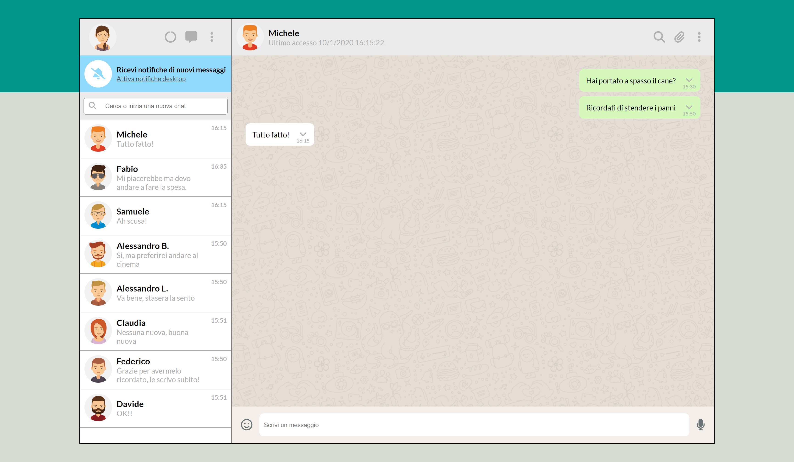
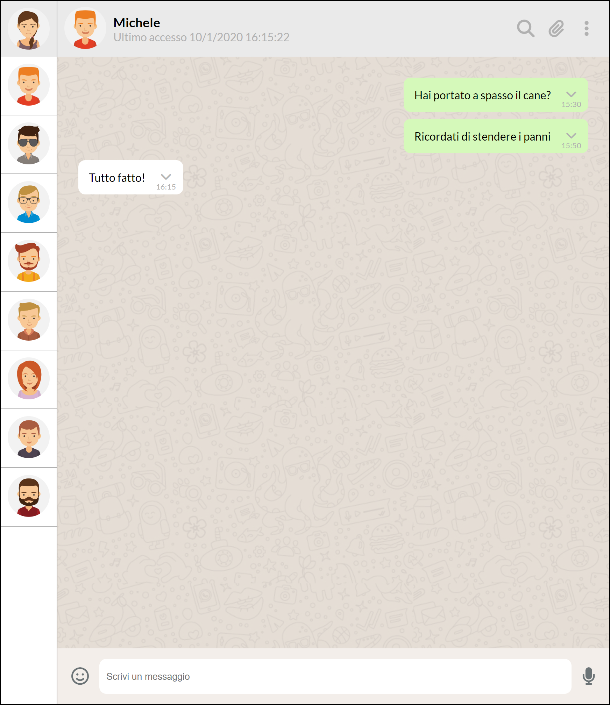
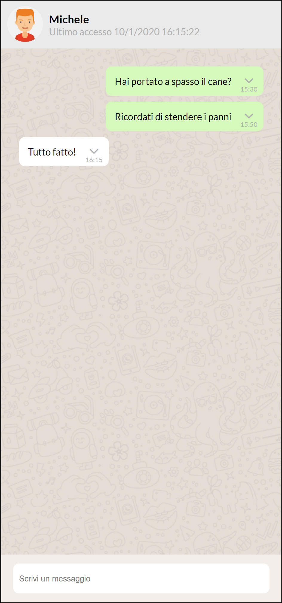

# Boolzapp

Boolzapp is a reproduction of Whatsapp.

With Boolzapp you can:
 
- Read chats
- Send messages
- Recieve an automatic answer
- Date/Time update on message sent
- Delete a single message
## Technologies used

 - Vue.js
 - Luxon

## Screenshots

### Desktop

### Tablet

### Mobile

